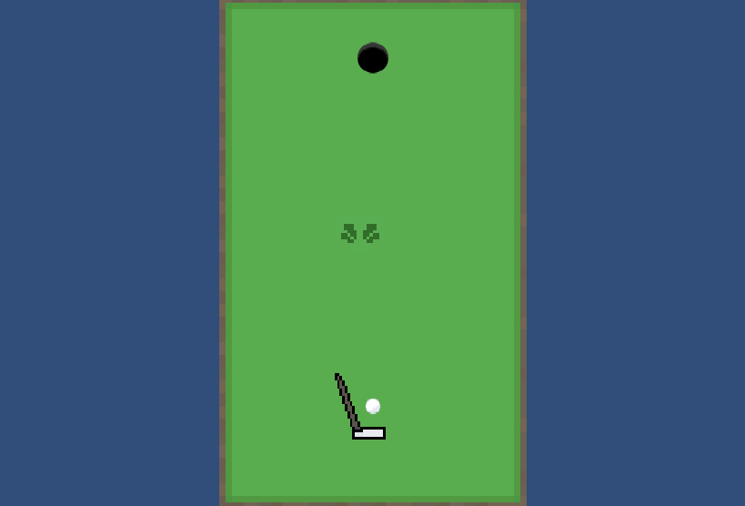
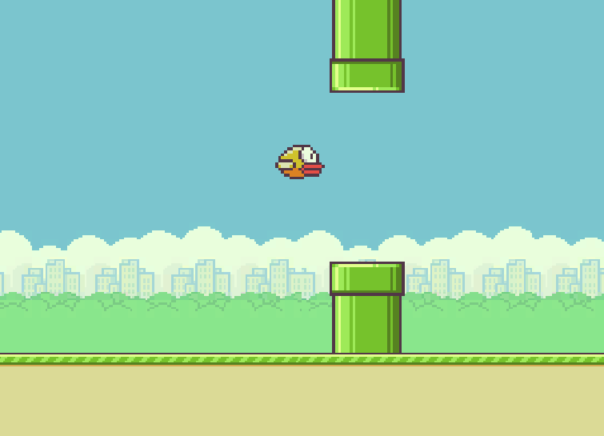
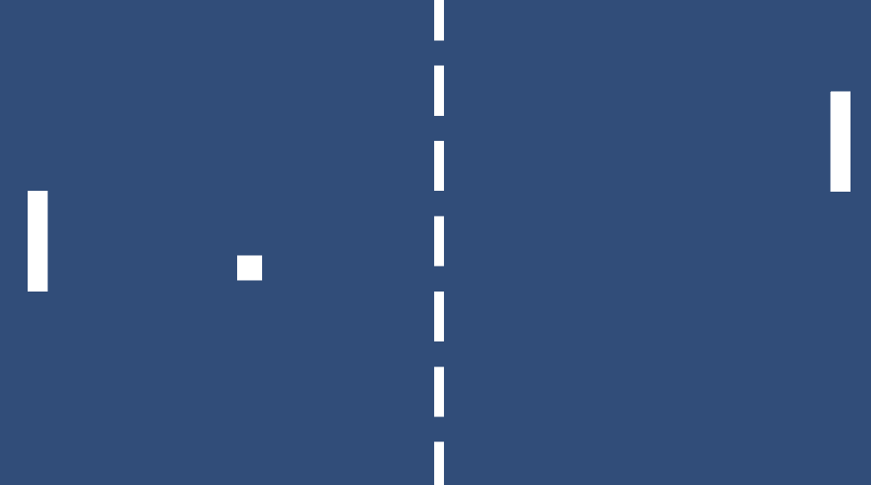

# D00 - Unity Basics

## Description

Assets, GameObject, Behaviour, Input, Transform

### Exercices

- Exercice 00 : Gonflage de Ballon Simulator 2015 
- Exercice 01 : Quick Time Event 
- Exercice 02 : Mini Golf
- Exercice 03 : Flappy Bird 
- Exercice 04 : Pong ! 

## Installation

Clone the repository and run with Unity:
No build require, all scene inside project

## Media

## Authors

Antoine Anzieu
aanzieu@student.42.fr
