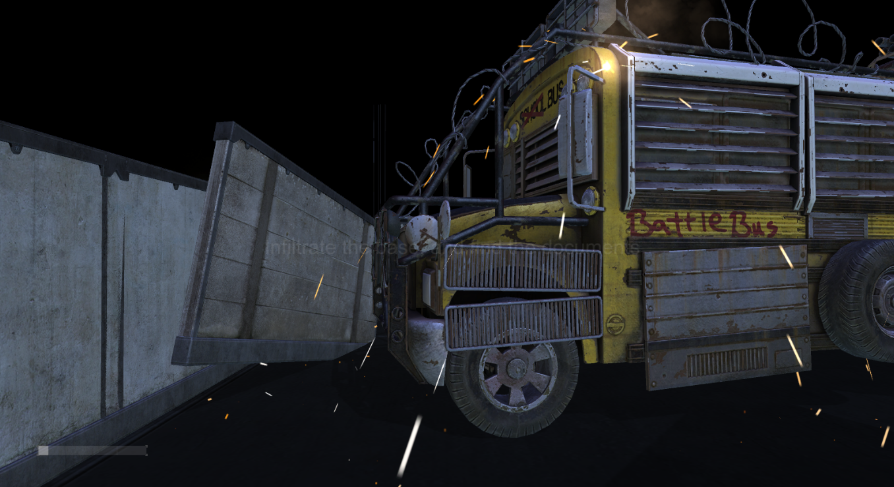
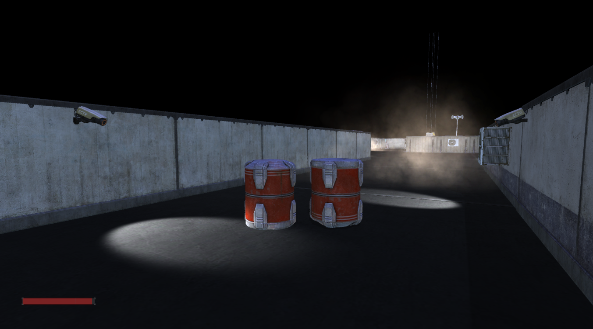
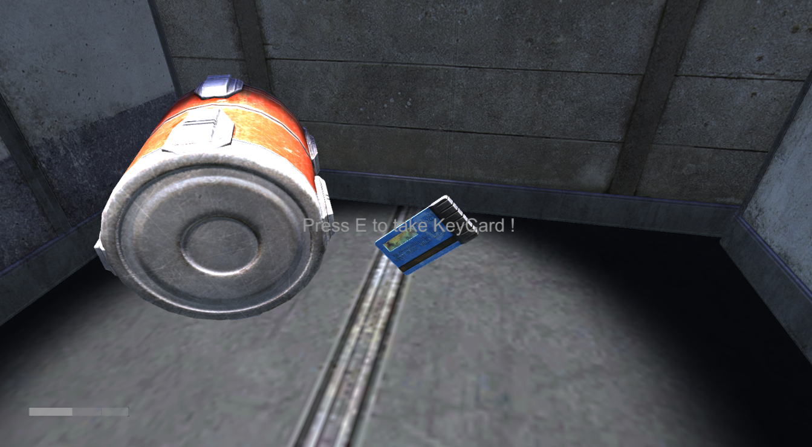
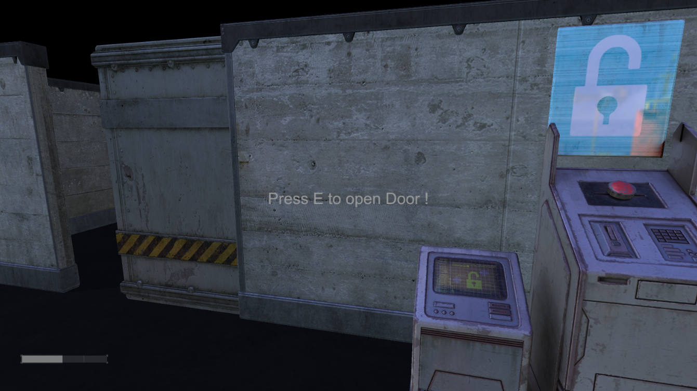

# D06 - 3D audio, shaders and particules

## Description

Mise en scène, Shaders, Lumières, Son 3D
First Person, MetalGear Style

### Exercices

- Exercice 00 : Les lieux du crime
- Exercice 01 : Et la lumière fut 
- Exercice 02 : Big Brother is watching you
- Exercice 03 : Un objectif
- Exercice 04 : La touche finale

## Installation

Clone the repository and run with Unity:
Build and fun

## Media

## Authors

Antoine Anzieu
aanzieu@student.42.fr
