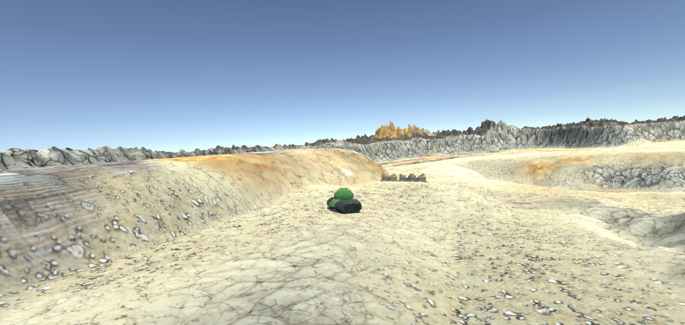
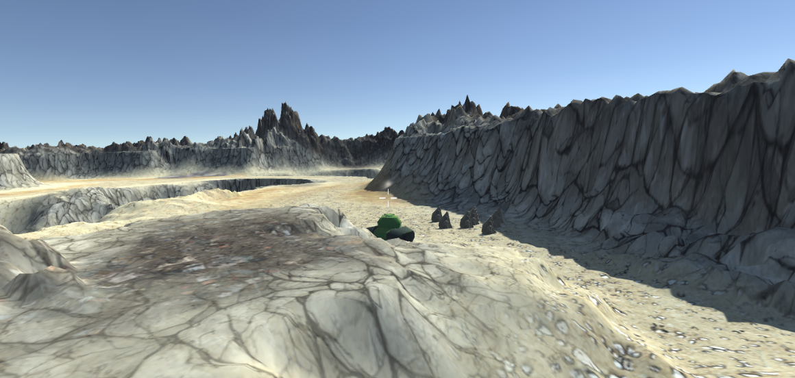

# D07 - GUI 3D, navmesh and raycasting

## Description

Navmesh, Physique 3D, GUI 3D
Tank Of War

### Exercices

- Exercice 00 : Dessine moi un bac à sable
- Exercice 01 : Un tank pour tous les gouverner
- Exercice 02 : Wargames
- Exercice 03 : Pimp My Tank !

## Installation

Clone the repository and run with Unity:
Buid and Fun!

## Media

## Authors

Antoine Anzieu
aanzieu@student.42.fr
